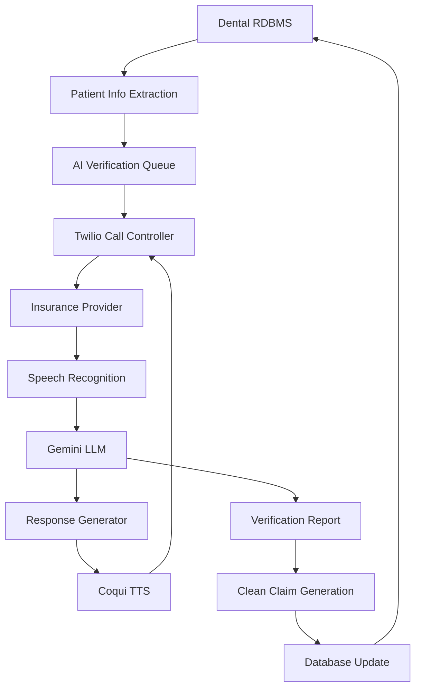

# 🦷 DentaVerify AI: Intelligent Dental Insurance Assistant
## Transforming Insurance Verification Through Automation and Intelligence

### 1. Executive Summary
The healthcare industry faces significant challenges in insurance verification, with 70% of providers reporting increasing denials and 27% of these denials relating to registration and eligibility issues. Our AI Dental Insurance Verification System addresses these challenges by automating the verification process, potentially saving practices $12.8 billion across the industry while reducing verification time by 14 minutes per transaction (CAQH Index 2022).

### 2. Current Industry Challenges

#### 2.1 Statistical Overview
- 90% of claim denials are preventable
- 8-10% average denial rates
- Denials account for 20% of practice expenses
- $25-$118 cost per claim resubmission
- 65% of denied claims are never resubmitted
- 69% of practices report increased denials (17% average increase)

#### 2.2 Primary Pain Points

1. **Verification Inefficiencies**
   - Manual processes consuming 14 minutes per transaction
   - Staff time spent on hold with insurance companies
   - Delayed verification results
   - Resource-intensive procedures

2. **Financial Impact**
   - $25-$118 cost per denied claim
   - Lost revenue from un-resubmitted claims
   - Delayed cash flow
   - Administrative overhead costs

3. **Common Error Sources**
   - Incorrect patient demographics (27% of denials)
   - Missing or outdated coverage information
   - Network status verification failures
   - Prior authorization oversights
   - Administrative errors in data entry

### 3. Solution Architecture
The following flow chart was generated using [mermaid](https://mermaid.live/edit#pako:eNpVkd1ygjAQhV9lJ9f6Alx0RkERxRkLtBcNvdjCIpkJCQ1Jf8bx3YsRW5ur7J4vJyfZE6t0TSxgR4N9C0VUKhjXgkekLErIouU-f4X5_AGW_IBWjG1IVKNh9WUNVlZo9Xo9s_RUyBcJPJMRjajwosKjI0cTE3om4sWnkEJDiFJCqJU1WkoyExR5aMUTNTiDqiI4GP0h6l9g5YE1z3uiqoWMKn1U4i7K2gMxj6kTSkCa7ich9sKGZzT0Wg0EMSkyaPXNeuOBhIf63QkoinzqJ9fg9y5b_u-ZGfXa2AnfemLHQ0moIJQouttVfyl3Hkp5hBbfcAzz1Ndob1-VenXBZqwj06GoxyGdLlLJbEsdlSwYtzU16KQtWanOI4rO6vxbVSywxtGMGe2OLQsalMNYOe8fCRyH3d2QHtWL1lN5_gG0SKSS).


### 4. AI Solution Components

#### 4.1 Automated Verification Process
- Real-time eligibility checks
- 7-day advance verification capability
- Network status confirmation
- Benefit validation
- Prior authorization tracking

#### 4.2 Intelligent Communication
- Natural language processing
- Context-aware responses
- Automated hold management
- Real-time data extraction
- Documentation compilation

#### 4.3 Error Prevention System
- Predictive error detection
- Data validation checks
- Coverage requirement verification
- Code accuracy confirmation
- Documentation completeness validation

### 5. Expected Benefits and ROI

#### 5.1 Hypothetical Mid-Size Practice Scenario
```
Current Scenario (Based on Industry Averages):
- Monthly claims: 500
- Average denial rate: 9%
- Monthly denied claims: 45
- Average cost per denial: $25-$118
- Monthly loss range: $1,125-$5,310
- Estimated annual loss range: $13,500-$63,720

Potential With AI System:
- Expected denial reduction: Up to 27% (industry benchmark)
- New monthly denied claims estimate: 33
- Monthly cost avoidance range: $300-$1,431
- Projected annual savings range: $3,600-$17,172

Additional Revenue Recovery Opportunity:
- Currently unrecovered claims (65%): 29 claims/month
- Recovery opportunity with automation: TBD based on practice
- Potential monthly revenue recovery: Varies by procedure type
- Projected annual revenue impact: To be determined by practice specifics

Total Potential Annual Benefit:
- Direct cost avoidance: $3,600-$17,172
- Revenue recovery: Practice specific
- Staff time savings: 4-6 hours daily
- Total impact: To be determined based on practice metrics
```

#### 5.2 Operational Improvements
- Verification Time: From the current 14 minutes per transaction to near real-time processing
- Manual Tasks: From 4-6 hours daily to minimal human intervention required
- Accuracy: Significant increase in eligibility check accuracy through automated validation
- Availability: 24/7 verification capability vs. current business hours only


### 6. System Integration & Deployment Plan

#### 6.1 Phase 1: Foundation
1. **System Integration**
   - RDBMS connection
   - Telephony setup
   - LLM integration
   - Voice processing implementation

2. **Basic Automation**
   - Eligibility checks
   - Coverage verification
   - Error detection
   - Report generation

#### 6.2 Phase 2: Enhancement
1. **Advanced Features**
   - Multi-payer support
   - Complex verification handling
   - Predictive analytics
   - Custom reporting

2. **Optimization**
   - Performance tuning
   - Process refinement
   - Error reduction
   - User interface improvements

### 7. Risk Mitigation

#### 7.1 Technical Risks
- System downtime contingency
- Data accuracy assurance
- Integration failure prevention
- Performance monitoring

#### 7.2 Operational Risks
- Staff training programs
- Process transition management
- Insurance provider compatibility
- Compliance maintenance

### 8. Success Metrics

#### 8.1 Key Performance Indicators
- Denial rate reduction
- Verification speed improvement
- Staff productivity increase
- Patient satisfaction scores
- Revenue cycle efficiency

#### 8.2 Monitoring and Optimization
- Real-time performance tracking
- Error pattern analysis
- Process efficiency metrics
- Continuous improvement protocols

### 9. Conclusion
The AI Dental Insurance Verification System addresses critical industry challenges by automating and optimizing the verification process. With potential savings of 14 minutes per transaction and the ability to prevent up to 90% of claim denials, the system offers significant ROI while improving operational efficiency and patient satisfaction. The combination of advanced AI technology with automated communication capabilities positions this solution as a transformative tool for modern dental practices.

### 10. References
- [Coqui TTS](https://github.com/coqui-ai/TTS?tab=readme-ov-file)
- [The True Cost of Insurance Denials and How Automated Verification can Help](https://issuu.com/brownst303/docs/nysdjaugsept23_final_1/s/32963189)
- [What are Unnecessary Claim Errors costing you?](https://oncospark.com/what-are-unnecessary-claim-errors-costing-you/)
- [The Impact of Patient Eligibility Verification Mistakes on Claims](https://www.veritable.app/blog/the-impact-of-patient-eligibility-verification-mistakes-on-claims/)
- [Avoid the common eligibility verification errors that impact revenue](https://www.experian.com/blogs/healthcare/avoid-the-common-eligibility-verification-errors-that-impact-revenue/)
